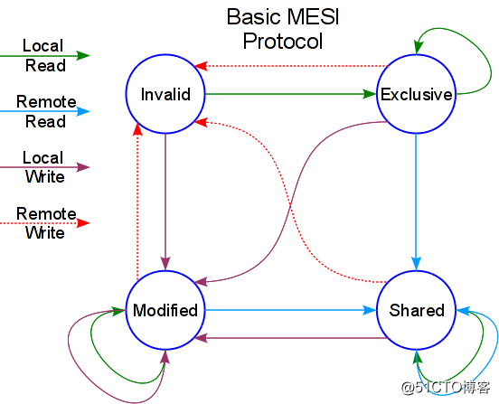

- 内存管理：

  linux内核运行需要动态分配内存，有两种分配方案：
  
  1.以页为单位分配内存，一次申请内存的长度必须是页的整数倍

  2.按需分配内存,一次申请内存的长度是随机的。

  第一种分配方案通过buddy子系统实现，第二种分配方案通过slab子系统实现。slab子系统随内核的发展衍生出slub子系统和slob子系统。最新通用服务器内核一般默认使用slub子系统，slob子系统一般用在移动端和嵌入式系统，较老内核默认用slab。slab,slob,slub功能相同，但效率上的偏重点不一样。

- 既然有了buddy子系统，为什么又基于buddy子系统实现slab子系统呢？

    **出于空间效率**：页的长度太小，会增加系统管理负担，一般页长度为4KB。举个例子：open系统调用中，用file数据结构描述被打开的文件。存放file数据结构需要的内存远远小于一个页，如果没有slab子系统，内核只有通过buddy子系统申请一个完整的页。一部分给file数据结构用，剩下的内存有两种方法处理。其一：open流程管理剩余内存，留作它用。如果内核的所有函数都要自己管理这种剩余内存，内存管理代码会分散到系统各个地方，显然是不科学的。其二：将每一个file装到一个页中，这个页剩余的内存不要了，这样会浪费内存空间。

    **出于时间效率**：buddy子系统相对于slab子系统复杂很多，每次调用alloc_pages和free_pages要付出惨重代价。内核中有些代码又必须频繁申请释放内存。slab充当内核各个子系统和buddy子系统之间的空闲内存“缓冲池”。内存被kfree释放后，短时期停留在slab子系统中，再次kmalloc时，直接从slab分配。避免每次内存分配释放都调用alloc_pages和free_pages。
    
- 既然有了slab子系统，是不是所有的内存分配都经过slab子系统接口分配？
  
  当然不是：
  
  1.slab子系统时为了内核申请内存专门设计的，比如应用程序缺页还是要通过alloc_pages和free_pages申请内存。
  
  2.内核中很多子系统必须通过alloc_pages和free_pages直接分配物理上连续的内存页。
  
  3.另外一点slab子系统申请的内存一定在NORMAL区或DMA区，分配不到HIGHMEM区的内存，而alloc_pages和free_pages能分配到HIGHMEM区的内存

- Cache基本原理
  - 用于平衡 CPU 和内存的性能差异，分为 L1/L2/L3 Cache。其中 L1/L2 是 CPU 私有，L3 是所有 CPU 共享。
  - 局部性原理
    - 时间局部性(Temporal Locality)：指如果某条指令一旦被执行，很有可能不久后还会再次被执行；如果某个数据一旦被访问了，很有可能不久之后还会再次被访问。如：循环、递归等。
    - 空间局部性(Spatial Locality)：指如果某个存储单元一旦被访问了，很有可能不久后它附件的存储单元也会被访问。如连续创建多个对象、数组等。

- Cache映射方式
  - 直接映射: 一个内存地址能被映射到的Cache line是**固定**的,就如每个人的停车位是固定分配好的，可以直接找到。
  
    缺点是：因为人多车位少，很可能几个人争用同一个车位，导致Cache***\*淘汰换出频繁\****，需要频繁的从主存读取数据到Cache，这个代价也较高。

  - 全关联映射: 主存中的一个地址可被映射进任意cache line，问题是：当寻找一个地址是否已经被cache时，需要遍历每一个cache line来寻找，这个代价很高。
  
  - 组关联映射: 组相联映射实际上是直接映射和全相联映射的折中方案，主存和Cache都**分组**，主存中一个**组内的块数**与Cache中的**分组数**相同，组间采用直接映射，组内采用全相联映射。
  
- 多核CPU下Cache保持一致、不冲突？
  - MESI：CPU中每个缓存行使用四种状态进行标记，使用2bit来表示
  
  - M 修改 (Modified)，E 独享、互斥 (Exclusive)，S 共享 (Shared)，I 无效 (Invalid)
  
  - https://blog.51cto.com/u_15060517/4336552
    
    
    
  
- Cache分配策略(Cache allocation policy)
  
    cache的分配策略是指我们什么情况下应该为数据分配cache line。cache分配策略分为读和写两种情况。
  
    读分配(read allocation)
  
    当CPU读数据时，发生cache缺失，这种情况下都会分配一个cache line缓存从主存读取的数据。默认情况下，cache都支持读分配。
  
    写分配(write allocation)
  
    当CPU写数据发生cache缺失时，才会考虑写分配策略。当我们不支持写分配的情况下，写指令只会更新主存数据，然后就结束了。当支持写分配的时候，我们首先从主存中加载数据到cache line中（相当于先做个读分配动作），然后会更新cache line中的数据。
  
- Cache更新策略(Cache update policy)
  
    cache更新策略是指当发生cache命中时，写操作应该如何更新数据。cache更新策略分成两种：写直通和回写。
  
    - 写直通(write through)
  
    当CPU执行store指令并在cache命中时，我们更新cache中的数据并且更新主存中的数据。**cache和主存的数据始终保持一致**。
  
    - 写回(write back)
  
    当CPU执行store指令并在cache命中时，我们只更新cache中的数据。并且每个cache line中会有一个bit位记录数据是否被修改过，称之为dirty bit（翻翻前面的图片，cache line旁边有一个D就是dirty bit）。我们会将dirty bit置位。主存中的数据只会在cache line被替换或者显示的clean操作时更新。因此，主存中的数据可能是未修改的数据，而修改的数据躺在cache中。**cache和主存的数据可能不一致。**