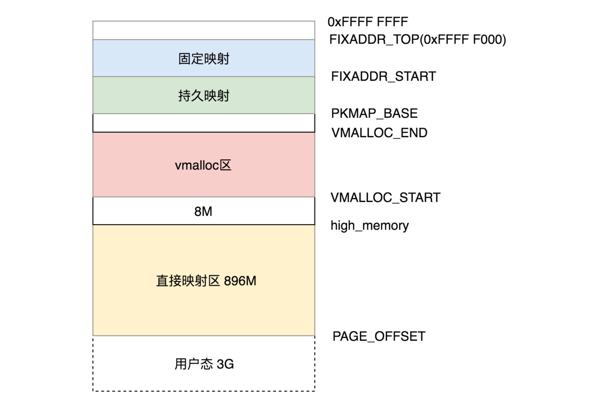

# Linux & OS

[TOC]

## IPC

管道、消息队列、共享内存、信号量、socket

## 系统调用

x86提供了分层的权限机制：ring0（内核）、ring1（设备驱动）、ring2（设备驱动）、ring3（应用）

用户态逻辑->系统调用->保存寄存器->内核态逻辑->恢复寄存器->系统调用返回->用户态逻辑

32位系统触发**0x80**软中断进入内核，64位系统通过**syscall**指令

**中断**：当前程序中用户的代码停止运行，根据中断的中断号，在中断向量表中找到对应的中断处理程序，并调用它。中断处理程序执行完成之后，CPU会继续执行之前的代码。原因有三种：用户主动（系统调用）、运行异常（异常）、外部因素（外部中断）

什么时候会进入内核态？
* 系统调用：用户进程主动要求切换到内核态的一种方式，用户进程通过系统调用申请操作系统提供的服务程序完成工作 
* 异常：当CPU在执行运行在用户态的程序时，发现了某些事件不可知的异常，这是会触发由当前运行进程切换到处理此异常的内核相关程序中，也就到了内核态，比如缺页异常。 
* 外围设备中断：当外围设备完成用户请求的操作之后，会向CPU发出相应的中断信号，这时CPU会暂停执行下一条将要执行的指令，转而去执行中断信号的处理程序。比如硬盘读写操作完成，系统会切换到硬盘读写的中断处理程序中执行后续操作等 

### 用户态核心态切换条件和原因


## 进程与线程

### PCB

**PCB 具体包含什么信息呢？**

进程描述信息：

- 进程标识符：标识各个进程，每个进程都有一个并且唯一的标识符；
- 用户标识符：进程归属的用户，用户标识符主要为共享和保护服务；

进程控制和管理信息：

- 进程当前状态，如 new、ready、running、waiting 或 blocked 等；
- 进程优先级：进程抢占 CPU 时的优先级；

资源分配清单

- 有关内存地址空间或虚拟地址空间的信息，所打开文件的列表和所使用的 I/O 设备信息。

CPU 相关信息：

- CPU 中各个寄存器的值，当进程被切换时，CPU 的状态信息都会被保存在相应的 PCB 中，以便进程重新执行时，能从断点处继续执行。

**每个 PCB 是如何组织的呢？**

通常是通过**链表**的方式进行组织，把具有**相同状态的进程链在一起，组成各种队列**。比如：

- 将所有处于就绪状态的进程链在一起，称为**就绪队列**；
- 把所有因等待某事件而处于等待状态的进程链在一起就组成各种**阻塞队列**；
- 另外，对于运行队列在单核 CPU 系统中则只有一个运行指针了，因为单核 CPU 在某个时间，只能运行一个程序。

### 任务ID

- 主线程：pid、tgid、group_leader都是它自己
- 子线程：pid是自己，tgid、group_leader是主线程

### 进程状态

有以下状态分类：

- **TASK_RUNNING**：表示进程在时刻准备运行的状态。如果抢到了时间片，那就运行；如果没有抢到，那就等待运行

- **TASK_INTERRUPTIBLE**：表示进程处于可中断睡眠状态。内核调用阻塞可以被信号中断。

- **TASK_UNINTERRUPTIBLE**：表示进程处于不可中断睡眠状态。内核调用阻塞不可以被信号中断。

- **TASK_KILLABLE**：表示进程处于不可中断睡眠状态，但是在阻塞期间可以相应KILL信号。

- **TASK_STOPPED**：程接收到 SIGSTOP、SIGTTIN、SIGTSTP 或者 SIGTTOU 信号之后进入该状态

- **TASK_TRACED**：进程执行被调试程序所停止。当一个进程被另外的进程所监视，每一个信号都会让进程进入该状态

- **EXIT_ZOMBIE**：进程执行结束，但是它的父进程还没有调用wait()

- **EXIT_DEAD**：进程彻底结束

- 状态转化如下图所示：

  

### 调度算法

Linux采用**完全公平调度算法**（CFS）。CPU会提供一个时钟，过一段时间就触发一个时钟中断。就像咱们的表滴答一下，这个我们叫 Tick。CFS 会为每一个进程安排一个虚拟运行时间vruntime。如果一个进程在运行，随着时间的增长，也就是一个个tick的到来，进程的vruntime将不断增大。没有得到执行的进程vruntime不变。显然，那些vruntime少的，原来受到了不公平的对待，需要给它补上，所以会优先运行这样的进程。

vruntime的计算方式如下所示： 

```
虚拟运行时间 vruntime += 实际运行时间 delta_exec * NICE_0_LOAD/ 权重
```

**CFS基于红黑树实现，每次调度时，会优先选择vruntime最小的节点**。

### 调度方式

- **主动调度**：陷入耗时的IO操作时，会主动让出CPU。整个过程分为以下两步：选取下一个被调度的进程；进行上下文切换
- **抢占式调度**：在内核处理时钟中断时，会发现一个进程运行的时间过长。此时，就会发生抢占式调度。但是抢占的时机只能是以下几种情况：
  - 用户态：系统调用返回用户态
  - 用户态：中断返回用户态
  - 内核态：有的系统调用不能被抢占，会主动打开preempt_disable。当再次启用preempt_enable时，就可以被抢占
  - 内核态：中断（例如时钟中断）返回内核态

### Fork

- 复制PCB
  1. Alloc New PCB （即task_struct，进程描述符）
  2. Alloc NewPCB.stack（创建内核栈）
  3. 调用memcpy拷贝Old PCB -> New PCB
  4. Alloc NewPCB.thread_info
  5. 更新New PCB中的信息，主要分为以下几个角度：
     - 重置运行时统计信息
     - 访问权限与父进程一致
     - 重置调度信息vruntime等，但是优先级等还是和父进程一致
     - 完全拷贝文件系统资源
     - 完全拷贝信号处理方式
     - 设置pid、tid等信息
     - 完全拷贝父进程的页表。运行时，采用写时复制进行替换
- 唤醒子进程
  1. 设置子进程状态为运行态
  2. 子进程尝试能否抢占父进程或者其他进程
  3. 父进程返回子进程的id，子进程返回0

### 进程、线程、协程区别

- 功能：进程是操作系统资源分配的基本单位，而线程是任务调度和执行的基本单位
- 开销：每个进程都有独立的内存空间；线程共享内存空间
- 运行环境：在操作系统中能同时运行多个进程；而在同一个进程中有多个线程同时执行
- 创建过程：在创建新进程的时候，会将父进程的所有五大数据结构复制新的，形成自己新的内存空间数据，而在创建新线程的时候，则是引用进程的五大数据结构数据，但是线程会有自己的私有数据、栈空间。（files_struct、fs_struct、sighand_struct、signal_struct、mm_struct）
- 进程和线程其实在cpu看来都是task_struct结构的一个封装，执行不同task即可，而且在cpu看来就是在执行这些task时候遵循对应的调度策略以及上下文资源切换定义，包括寄存器地址切换，内核栈切换。所以对于cpu而言，进程和线程是没有区别的。
- 协程是用户态线程


## 内存

### 概述

物理地址对进程而言是不可见的，任何进程都不能直接访问物理地址。操作系统会给进程分配一个虚拟地址。所有进程看到的这个地址都是一样的，里面的内存都是从 0 开始编号。在程序里面，指令写入的地址是虚拟地址。例如，位置为 10M 的内存区域，操作系统会提供一种机制，将不同进程的虚拟地址和不同内存的物理地址映射起来。当程序要访问虚拟地址的时候，由内核的数据结构进行转换，转换成不同的物理地址，这样不同的进程运行的时候，写入的是不同的物理地址，这样就不会冲突了。

### 虚拟内存

> 所有用户态进程共享同一个内核态空间

用户态内存与内核态内存的划分比例如下：


用户态虚拟内存空间布局：


内核态虚拟内存空间布局：



### 内存分配

- linux内核运行需要动态分配内存，有两种分配方案：

  1. 以页为单位分配内存，一次申请内存的长度必须是页的整数倍

  2. 按需分配内存,一次申请内存的长度是随机的。

  第一种分配方案通过buddy子系统实现，第二种分配方案通过slab子系统实现。slab子系统随内核的发展衍生出slub子系统和slob子系统。最新通用服务器内核一般默认使用slub子系统，slob子系统一般用在移动端和嵌入式系统，较老内核默认用slab。slab,slob,slub功能相同，但效率上的偏重点不一样。

- 既然有了buddy子系统，为什么又基于buddy子系统实现slab子系统呢？

  **出于空间效率**：页的长度太小，会增加系统管理负担，一般页长度为4KB。

  **出于时间效率**：buddy子系统相对于slab子系统复杂很多，每次调用alloc_pages和free_pages要付出惨重代价。内核中有些代码又必须频繁申请释放内存。slab充当内核各个子系统和buddy子系统之间的空闲内存“缓冲池”。内存被kfree释放后，短时期停留在slab子系统中，再次kmalloc时，直接从slab分配。避免每次内存分配释放都调用alloc_pages和free_pages。

- 既然有了slab子系统，是不是所有的内存分配都经过slab子系统接口分配？

  当然不是：

  1.slab子系统时为了内核申请内存专门设计的，比如应用程序缺页还是要通过alloc_pages和free_pages申请内存。

  2.内核中很多子系统必须通过alloc_pages和free_pages直接分配物理上连续的内存页。

  3.另外一点slab子系统申请的内存一定在NORMAL区或DMA区，分配不到HIGHMEM区的内存，而alloc_pages和free_pages能分配到HIGHMEM区的内存

## Cache

### Cache基本原理

- 用于平衡 CPU 和内存的性能差异，分为 L1/L2/L3 Cache。其中 L1/L2 是 CPU 私有，L3 是所有 CPU 共享。
- 局部性原理
  - 时间局部性(Temporal Locality)：指如果某条指令一旦被执行，很有可能不久后还会再次被执行；如果某个数据一旦被访问了，很有可能不久之后还会再次被访问。如：循环、递归等。
  - 空间局部性(Spatial Locality)：指如果某个存储单元一旦被访问了，很有可能不久后它附件的存储单元也会被访问。如连续创建多个对象、数组等。

### Cache映射方式

- 直接映射: 一个内存地址能被映射到的Cache line是**固定**的,就如每个人的停车位是固定分配好的，可以直接找到。

  缺点是：因为人多车位少，很可能几个人争用同一个车位，导致Cache***\*淘汰换出频繁\****，需要频繁的从主存读取数据到Cache，这个代价也较高。

- 全关联映射: 主存中的一个地址可被映射进任意cache line，问题是：当寻找一个地址是否已经被cache时，需要遍历每一个cache line来寻找，这个代价很高。

- 组关联映射: 组相联映射实际上是直接映射和全相联映射的折中方案，主存和Cache都**分组**，主存中一个**组内的块数**与Cache中的**分组数**相同，组间采用直接映射，组内采用全相联映射。

### 多核CPU下Cache保持一致、不冲突？

- MESI：CPU中每个缓存行使用四种状态进行标记，使用2bit来表示

- M 修改 (Modified)，E 独享、互斥 (Exclusive)，S 共享 (Shared)，I 无效 (Invalid)

- https://blog.51cto.com/u_15060517/4336552
  

  

### Cache分配策略(Cache allocation policy)

cache的分配策略是指我们什么情况下应该为数据分配cache line。cache分配策略分为读和写两种情况。

- 读分配(read allocation)

  当CPU读数据时，发生cache缺失，这种情况下都会分配一个cache line缓存从主存读取的数据。默认情况下，cache都支持读分配。

- 写分配(write allocation)

  当CPU写数据发生cache缺失时，才会考虑写分配策略。当我们不支持写分配的情况下，写指令只会更新主存数据，然后就结束了。当支持写分配的时候，我们首先从主存中加载数据到cache line中（相当于先做个读分配动作），然后会更新cache line中的数据。


### Cache更新策略(Cache update policy)

  cache更新策略是指当发生cache命中时，写操作应该如何更新数据。cache更新策略分成两种：写直通和回写。

  - 写直通(write through)

     当CPU执行store指令并在cache命中时，我们更新cache中的数据并且更新主存中的数据。**cache和主存的数据始终保持一致**。

  - 写回(write back)

     当CPU执行store指令并在cache命中时，我们只更新cache中的数据。并且每个cache line中会有一个bit位记录数据是否被修改过，称之为dirty bit（翻翻前面的图片，cache line旁边有一个D就是dirty bit）。我们会将dirty bit置位。主存中的数据只会在cache line被替换或者显示的clean操作时更新。因此，主存中的数据可能是未修改的数据，而修改的数据躺在cache中。**cache和主存的数据可能不一致。**

## 其他

### mmap

零拷贝技术之一，`mmap`主要实现方式是将读缓冲区的地址和用户缓冲区的地址进行映射，内核缓冲区和应用缓冲区共享，从而减少了从读缓冲区到用户缓冲区的一次CPU拷贝。

### sendfile

`sendfile`数据可以直接在内核空间进行传输，因此避免了用户空间和内核空间的拷贝，同时由于使用`sendfile`替代了`read+write`从而节省了一次系统调用，也就是2次上下文切换。
