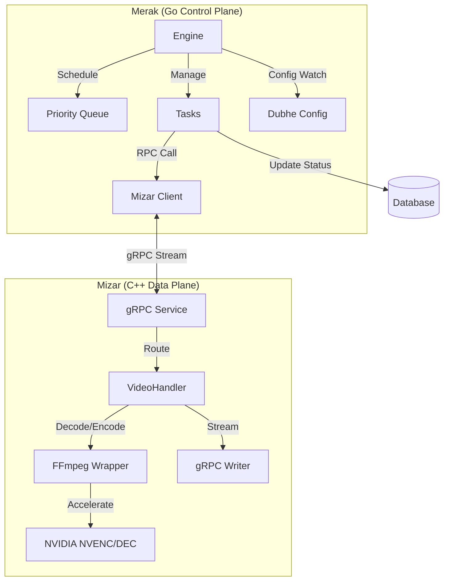

# Merak & Mizar 系统设计

基于 `dipper` 项目中的 `merak` 和 `mizar` 代码库，以下是对其架构和优秀设计模式的深度解析。

## 一、 系统概览

该系统采用了 **控制面与数据面分离** 的经典微服务架构：
*   **Merak (Go)**: 作为 **控制面 (Control Plane)**。负责业务逻辑、任务调度、资源管理、与外部系统交互。利用 Go 语言的高并发和开发效率优势。
*   **Mizar (C++)**: 作为 **数据面 (Data Plane)**。负责高性能的视频/图像处理、编解码、算法推理对接。利用 C++ 在媒体处理和底层硬件控制上的性能优势。

---

## 二、 核心设计：Merak (调度与控制)

Merak 的核心是一个极其健壮的 **任务调度引擎 (Engine)**，实现了复杂的优先级调度和模式切换。

### 1. 优先级抢占式调度 (Priority Preemptive Scheduling)

在 `merak/core/engine.go` 中，`Scheduler` 实现了一个精细的抢占逻辑：

*   **设计原理**: 系统维护一个 `PriorityQueue` (任务队列) 和 `tasks` (运行中任务表)。
*   **抢占机制**: 当一个高优先级任务（如实时分析）进入队列时，调度器会主动 **中断 (Stop)** 当前正在运行的低优先级任务（如历史回溯），将其放回队列，优先执行高优先级任务。
*   **代码体现**:
    ```go
    // core/engine.go 调度循环片段
    if t.Priority() != 0 && (currentHighestPriorityTask == nil || t.Priority() < currentHighestPriorityTask.Priority()) {
        if currentHighestPriorityTask != nil {
            // 中断低优先级任务
            currentHighestPriorityTask.Stop()
            e.taskQueue.Push(currentHighestPriorityTask) // 重新入队
        }
        // 启动高优先级任务
        t.Start()
    }
    ```

### 2. 双模式引擎 (Dual-Mode Engine)

引擎支持动态切换运行模式，适应不同的业务场景：

*   **NearRealTime (近实时模式)**: 侧重于处理当前的视频流，低延迟。
*   **BackTrack (回溯模式)**: 侧重于处理历史录像，高吞吐。
*   **动态切换**: 通过监听配置中心 (`DubheClient`) 的变化，实时调用 `SwitchMode`，自动清理旧模式任务并初始化新队列，无需重启服务。

### 3. 健壮的运维设计

*   **快照并发控制**: 通过 `snapshotParallelism` 配置限制并发度，防止内存溢出（OOM）。
*   **Core Dump 捕获**: 在 `README.md` 中明确了容器环境下的 Core Dump 捕获方案（挂载宿主机目录、修改内核参数），这是生产环境排查 CGO 或底层崩溃的关键设计。

---

## 三、 核心设计：Mizar (高性能媒体引擎)

Mizar 是一个基于 gRPC 的高性能媒体服务器，底层深度封装了 FFmpeg，展现了优秀的 C++ 资源管理和性能优化能力。

### 1. RAII 资源管理 (Resource Acquisition Is Initialization)

FFmpeg 的 C API 需要繁琐的手动内存管理。Mizar 通过 `VideoHandler` 类实现了 RAII 模式：

*   **自动释放**: 在析构函数 `~VideoHandler()` 中统一释放 `AVPacket`、`AVFrame`、`AVCodecContext` 等资源。
*   **宏定义辅助**: 使用 `FREE_AV_PACKET` 等宏来标准化释放流程，避免内存泄漏或野指针。

### 2. 流式零拷贝传输 (Streaming Zero-Copy)

为了极致性能，Mizar 避免了 "下载文件 -> 处理 -> 保存文件 -> 读取返回" 的传统低效流程，而是实现了 **流式处理**：

*   **自定义 IO Context**: 通过 `avio_alloc_context` 和回调函数 `writePacketToGrpc`，将 FFmpeg 编码后的数据流直接写入 gRPC 的 `ServerWriter`。
*   **内存直通**: 转码后的视频或截取的图片不落盘，直接在内存中通过 gRPC 流传输给 Merak 或其他客户端。

```cpp
// mizar.cpp
outputAvIoCtx = avio_alloc_context(outputBuffer, BUFFER_SIZE, 1, this, nullptr, writePacketToGrpc, nullptr);
// 编码器直接向 outputAvIoCtx 写数据，实际上触发 writePacketToGrpc 发送给 gRPC 客户端
```

### 3. 硬件加速集成 (Hardware Acceleration)

显式集成了 NVIDIA GPU 加速：
*   **混合流水线**: 支持 `hevc_nvenc` (编码) 和 `hevc_cuvid` (解码)。
*   **显存管理**: 显式管理 `AVBufferRef *hwDeviceCtx` 和 `AVBufferRef *hwFramesCtx`，确保 GPU 上下文正确初始化和复用。

---

## 四、 整体架构图



## 五、 总结

这套系统展示了 **"异构语言协作"** 的优秀实践：

1.  **Go (Merak)** 处理复杂的业务状态机、并发调度和外部通信，代码清晰易维护。
2.  **C++ (Mizar)** 专注于计算密集型的媒体处理，通过精细的内存控制和硬件加速榨取性能。
3.  **中间件 (gRPC)** 提供了强类型的通信契约，使得两端可以独立迭代，互不干扰。

这种设计既保证了开发效率（大部分业务逻辑在 Go 中），又保证了核心性能（媒体处理在 C++ 中），是现代多媒体处理系统的典范。
